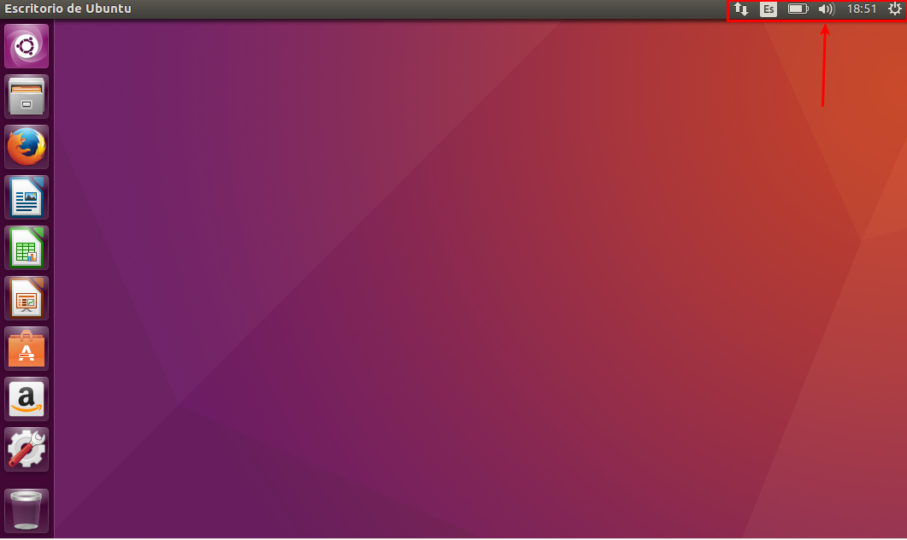
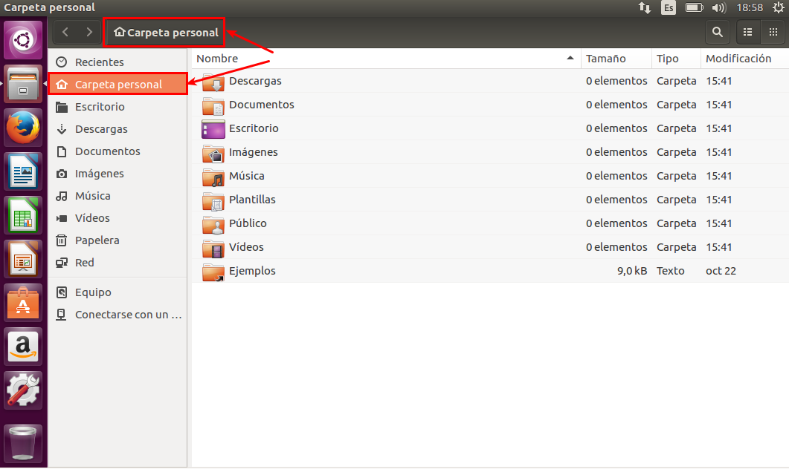
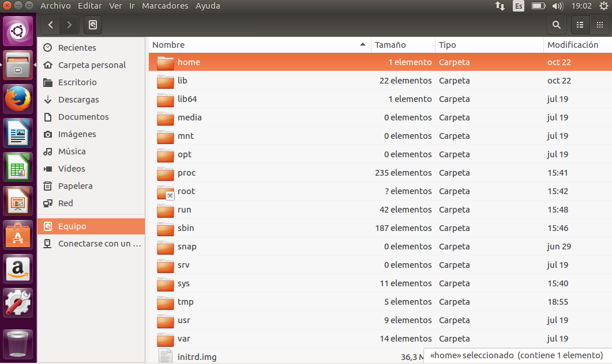
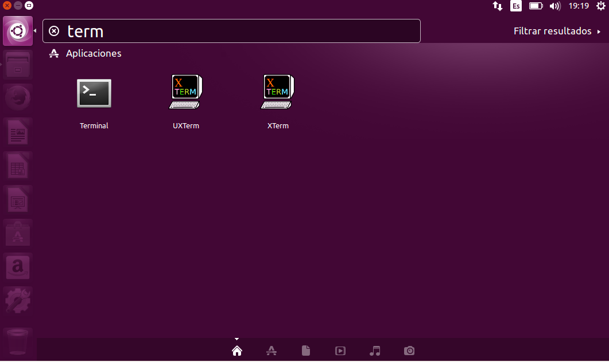
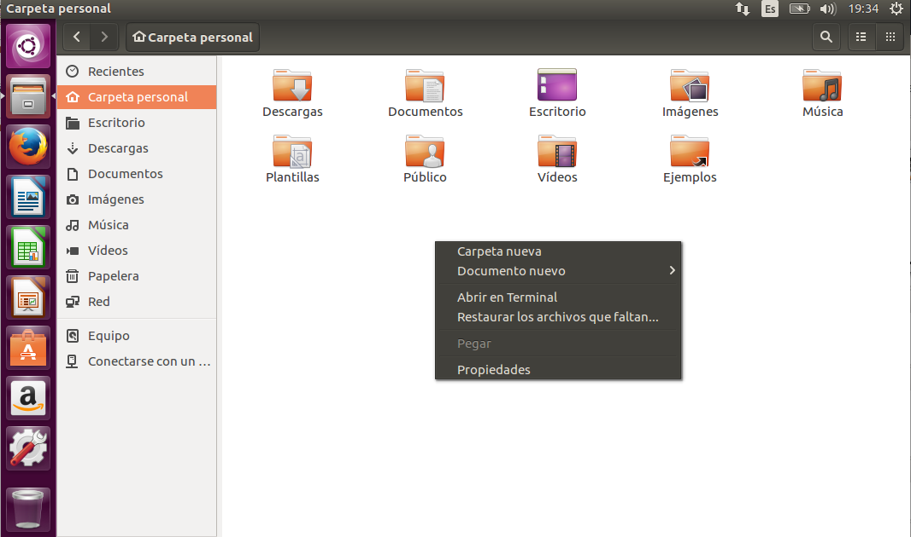
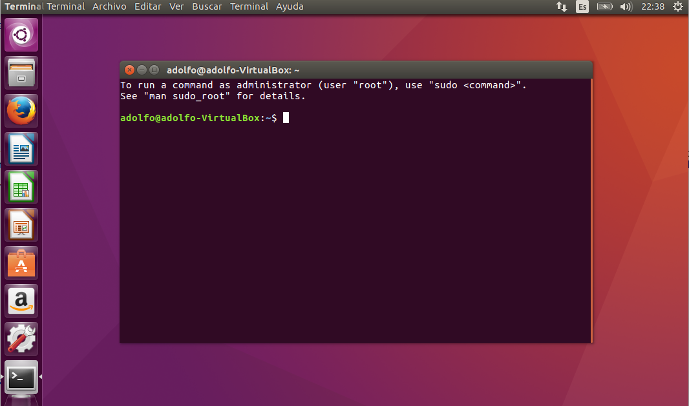

% Introducción Ubuntu
% Adolfo Sanz De Diego
% Noviembre 2016

# Acerca de

## Autor

- **Adolfo Sanz De Diego**
    - Blog: [asanzdiego.blogspot.com.es](http://asanzdiego.blogspot.com.es/)
    - Correo: [asanzdiego@gmail.com](mailto:asanzdiego@gmail.com)
    - GitHub: [github.com/asanzdiego](http://github.com/asanzdiego)
    - Twitter: [twitter.com/asanzdiego](http://twitter.com/asanzdiego)
    - LinkedIn: [in/asanzdiego](http://www.linkedin.com/in/asanzdiego)
    - SlideShare: [slideshare.net/asanzdiego](http://www.slideshare.net/asanzdiego/)

## Licencia

- **Este obra está bajo una licencia:**
    - [Creative Commons Reconocimiento-CompartirIgual 3.0](http://creativecommons.org/licenses/by-sa/3.0/es/)

## Fuente

- Las slides y sus fuentes las podéis encontrar en:
    - <https://github.com/asanzdiego/curso-intro-linux-web-sql-2016>

# Introducción

## ¿Qué es?

- Ubuntu es una distribución de **GNU/Linux**.

- GNU/Linux es un Sistema Operativo que se distribuye como **Software Libre**.

## La interfaz superior

- En la parte superior de la pantalla principal hay unos
**iconos** de la red, el sonido, la fecha y el de apagar,
reiniciar el equipo junto a otras opciones, como la
configuración del sistema.

## La interfaz izquierda

- En el lateral izquierdo están los iconos de algunas
**aplicaciones** que que se instalan por defecto como
LibreOffice (suite ofimatica que abre y guarda
archivos de Word, Excel y PowerPoint), el navegador
Firefox, etc.

# Archivos

## Nautilus

- El **navegador de archivos** de Ubuntu se denomina
Nautilus (es el equivalente al Explorador de
Windows), y se localiza en la barra izquierda debajo
del logo de Ubuntu.

## Apariencia

- A la **izquierda** están los directorios, los discos duros,
extraibles, etc, y a la **derecha** lo que hay dentro de
cada uno de ellos.

## Modos

- Los archivos pueden verse de dos formas (**modo
iconos, modo lista**)

## Home

- Todo usuario tiene asociado una **Carpeta personal**
dónde puede crear y borrar carpetas y documentos
con entera libertad. Está situado en
/home/nombreusuario y tiene asociado el icono de
una casa.

## Ruta

- Para **saber donde estamos** la ventana nos muestra la
ruta (después de las flechas Lugar anterior y
Siguiente). En la captura siguiente muestra que nos
encontramos en /home/imágenes.

## El raiz

- El sistema de archivos tiene un **directorio principal (/)**
dónde se encuentran el resto de carpetas o archivos:

## Los discos duros

- En Linux no existen letras (C:\,D:\) para referirse a
las unidades.

- Los discos duros comienzan con la letra hd o sd si
el disco es SATA seguido de una letra (indica el
numero de disco duro) y un numero (indica el
numero de la partición). Por ejemplo hda1 indica
primera partición del primer disco duro.

- En Linux se trata **todos los elementos como
archivos (incluso el hardware)** en los que se puede
leer y escribir información.

## Archivos ocultos

- Los archivos ocultos se caracterizan por
llevar **un . (punto) delante** del
nombre (para verlos se pulsa Ctrl+H).

## Buscar

- Para buscar algo en el sistema pulsamos sobre el
**logo de ubuntu**, y en la cuadro de texto se introduce
lo que se busca.

# Gestionar carpetas

## Nueva carpeta

- Para crear una carpeta nueva en nuestro directorio,
se pulsa **botón derecho** del ratón, y aparece la
opción de crear una nueva carpeta.

## Propiedades

- Se pueden consultar las propiedades de cada
carpeta pulsando sobre **botón derecho** del ratón
sobre la carpeta seleccionada.

# El terminal

## ¿Qué es?

- Es un **intérprete de comandos** que permite
interactuar al usuario con el sistema.

## Arranque

- Se puede arrancar de diversas formas:
    - Ctrl+Alt+T.
    - Desde el buscador basta escribir Terminal.

## Indicador

- El terminal muestra en pantalla un indicador
de línea de ordenes esperando que el usuario
introduzca una orden. El indicador finaliza por
un caracter **$ en el caso de usuarios normales
o # en el caso del superusuario**.

## Usuario

- Al comienzo de la línea de ordenes aparece
nuestro **usuario y el nombre del ordenador**.

~~~
usuario@ordenador:~$
~~~

## Ejecutar

- Cuando escribimos un comando para que se
ejecute, hay que pulsar la **tecla Enter**.

## Tabulador

- Mientras escribimos si pulsamos el tabulador
el terminal intenta **autocompletar** lo que escribimos,.

## Inicio

- El terminal siempre esta dentro de una carpeta
especifica y puede navegar hasta otras carpetas y
puede gestionar los archivos. En este sentido
cuando se abre siempre esta en la **carpeta
personal del usuario**.

## Case sensitive

- Los comandos hay que teclearlos exactamente.
En este sentido las **letras mayúsculas y
minúsculas se consideran como diferentes**.

# Principales carpetas

## Introducción

- Lo siguiente no es muy importante, pero está bien
conocerlo, al menos a grandes rasgos.

## /, bin y boot

- /: Representa el nivel mas alto dentro de la
jerarquía y contiene el resto de carpetas,
particiones y otros dispositivos.
- /bin: Contiene los ejecutables propios de Linux.
- /boot: Contiene los archivos necesarios para el
inicio del sistema.

## dev y etc

- /dev: Contiene los dispositivos del sistema que
son tratados como un fichero más.
- /etc: Contiene los ficheros de configuración de los
programas instalados y ciertos scripts que se
ejecutan en el inicio del sistema. Pueden ser
sustituidos por ficheros de configuración propios
de cada usuario

## home y lib

- /home: Directorio que contiene un directorio
(carpeta personal) por cada usuario dado de alta
en el sistema.
- /lib: Contiene las bibliotecas o librerías del
sistema, así como módulos y controladores
(drivers).

## media y mnt

- /media: Es el lugar dónde se montan las unidades
extraibles como los dispositivos USB, disqueteras,
unidades de CD/DVD y en algunas distribuciones
las particiones adicionales.
- /mnt: Es el directorio que se suele usar para
montajes temporales de unidades.

## opt y proc

- /opt: Es el directorio destinado para
guardar paquetes adicionales de
aplicaciones.
- /proc: Contiene informacion para la
virtualizacion del sistema de ficheros de
Linux.

## root, sbin y srv

- /root: Es la carpeta personal del administrador.
- /sbin: Contiene los ejecutables de administración.
- /srv: Contiene información del sistema
sobre ciertos servicios que ofrece (FTP, HTTP...).

## sys y tmp

- /sys: Contiene información sobre los dispositivos
tal y como los ve el kernel Linux.
- /tmp: Es un directorio donde se almacenan
ficheros temporales. Cada vez que se inicia el
sistema este directorio se limpia.

## usr/bin, usr/include

- /usr/bin: Ejecutables de la mayoría de las
aplicaciones de escritorio.
- /usr/include: Archivos cabecera para C y C++.

##  usr/lib y usr/local

- /usr/lib: Bibliotecas para C y C++.
- /usr/local: Tiene una jerarquía parecida al directorio /usr.

## usr/sbin, usr/share y usr/src

- /usr/sbin: Comandos administrativos para el sistema.
- /usr/share:Archivos compartidos como
ficheros de configuración, imágenes, iconos...
- /usr/src: Contiene el código fuente para el
kernel de Linux.

## var

- /var: Contiene ficheros del sistema como el buffer
de impresión, logs(registros de datos):

## var/cache y var/lib

- /var/cache: Datos cacheados para las
aplicaciones.
- var/lib: Información sobre el estado actual de
las aplicaciones.

## var/lock y var/log

- /var/lock: Ficheros que se encargan de que un
recurso solo sea usado por una aplicacion
determinada que ha pedido su exclusividad,
hasta que esta lo libere.
- /var/log: Guarda los logs (registros de datos)
del sistema.

## var/mail, var/opt y var/run

- /var/mail: Guarda los correos de los usuarios.
- /var/opt: Almacena los datos usados por los
paquetes almacenados en /opt.
- /var/run: Almacena informacion sobre el
sistema desde que se inicio.

## var/spool y var/tmp

- /var/spool: Almacena datos esperando a que
sean tratados por algún tipo de proceso.
- /var/tmp: Almacena ficheros temporales que
no se borran al reiniciar el equipo.
