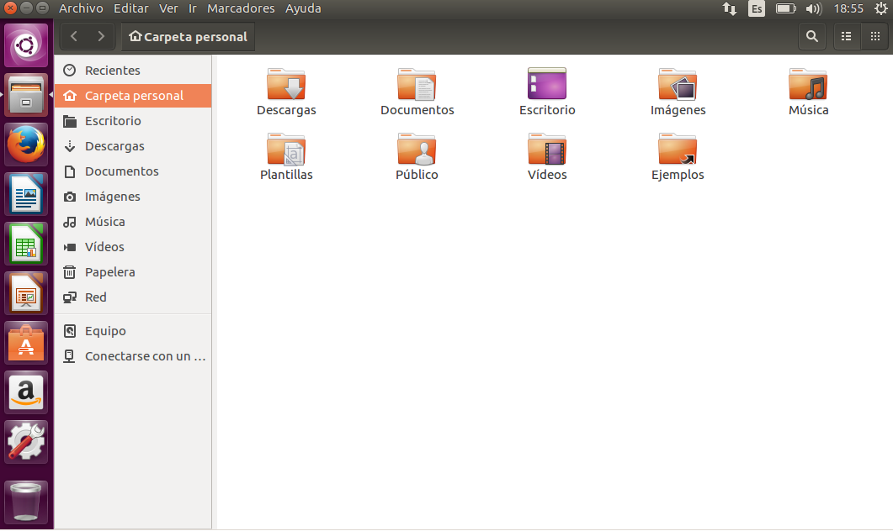
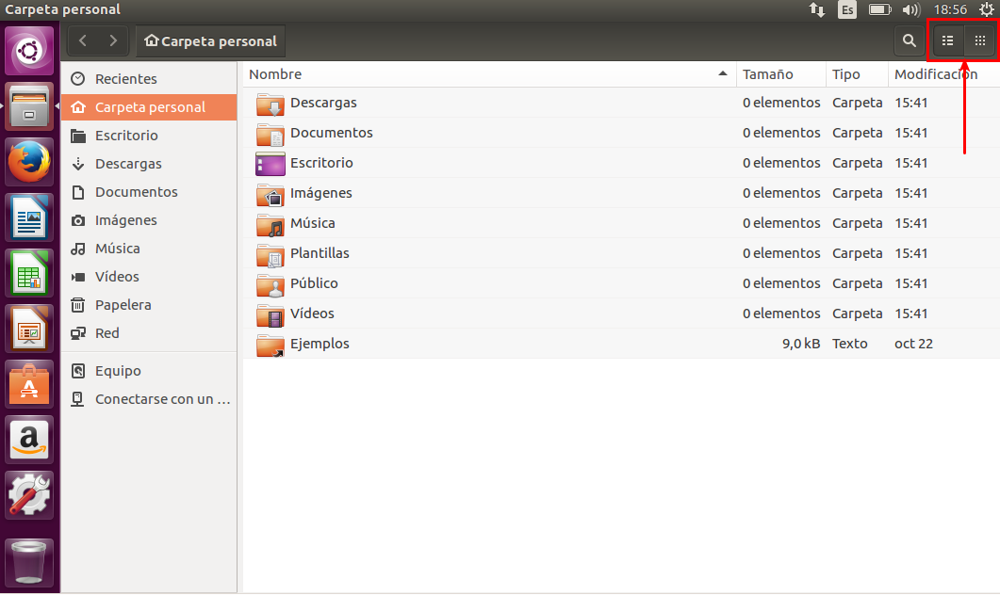
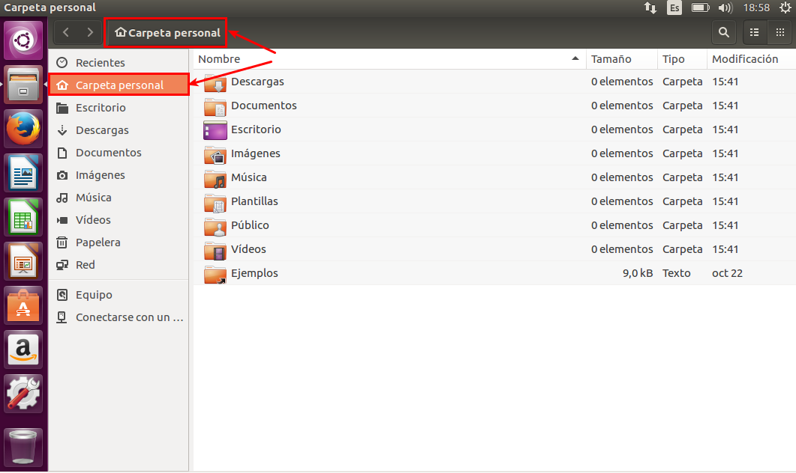
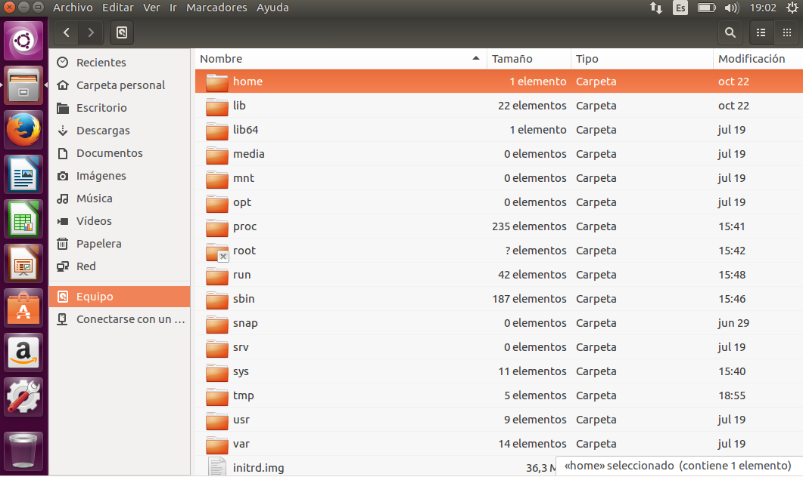
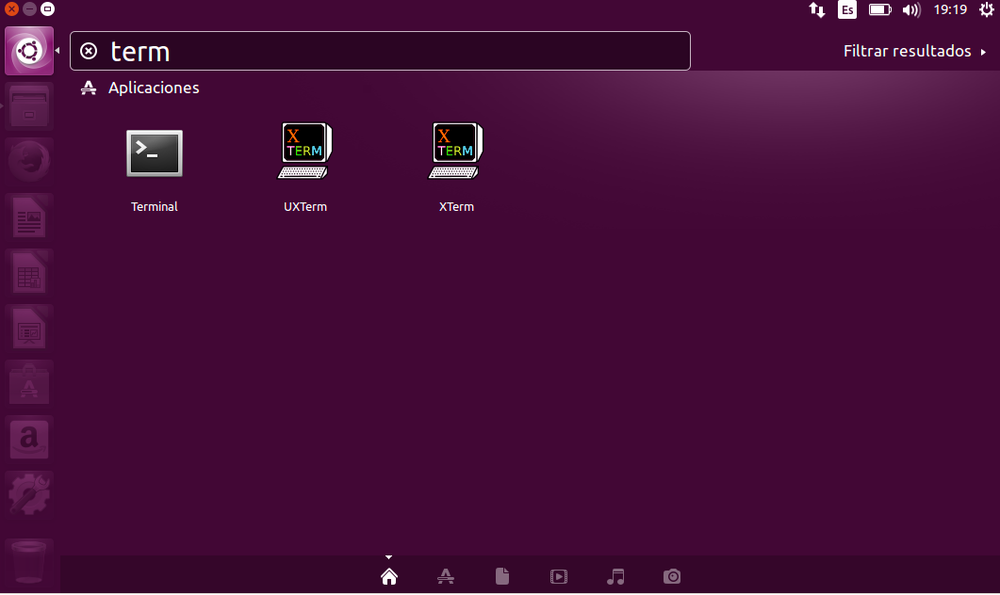
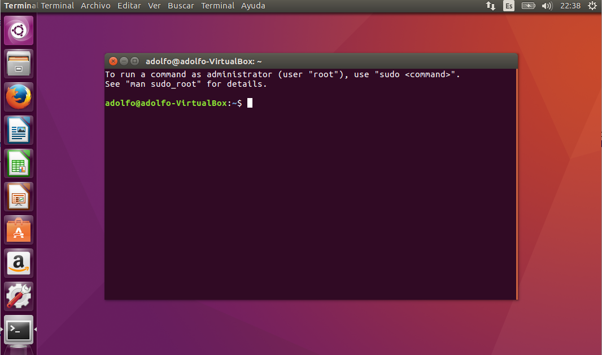

% Introducción Ubuntu
% Adolfo Sanz De Diego
% Noviembre 2016

# Acerca de

## Autor

- **Adolfo Sanz De Diego**
    - Blog: [asanzdiego.blogspot.com.es](http://asanzdiego.blogspot.com.es/)
    - Correo: [asanzdiego@gmail.com](mailto:asanzdiego@gmail.com)
    - GitHub: [github.com/asanzdiego](http://github.com/asanzdiego)
    - Twitter: [twitter.com/asanzdiego](http://twitter.com/asanzdiego)
    - LinkedIn: [in/asanzdiego](http://www.linkedin.com/in/asanzdiego)
    - SlideShare: [slideshare.net/asanzdiego](http://www.slideshare.net/asanzdiego/)

## Licencia

- **Copyright:**
    - Antonio Sarasa Cabezuelo <[antoniosarasa@campusciff.net](mailto:antoniosarasa@campusciff.net)>

## Fuente

- Las slides y sus fuentes las podéis encontrar en:
    - <https://github.com/asanzdiego/curso-intro-linux-web-sql-2016>

# Introducción

## ¿Qué es?

- Ubuntu es una distribución de **GNU/Linux**.

- GNU/Linux es un Sistema Operativo que se distribuye como **Software Libre**.

## La interfaz superior

- En la parte superior de la pantalla principal hay unos
**iconos** de la red, el sonido, la fecha y el de apagar,
reiniciar el equipo junto a otras opciones, como la
configuración del sistema.

## La interfaz izquierda

- En el lateral izquierdo están los iconos de algunas
**aplicaciones** que que se instalan por defecto como
LibreOffice (suite ofimatica que abre y guarda
archivos de Word, Excel y PowerPoint), el navegador
Firefox, etc.

# Archivos

## Nautilus

- El **navegador de archivos** de Ubuntu se denomina
Nautilus (es el equivalente al Explorador de
Windows), y se localiza en la barra izquierda debajo
del logo de Ubuntu.

## Apariencia

- A la **izquierda** están los directorios, los discos duros,
extraibles, etc, y a la **derecha** lo que hay dentro de
cada uno de ellos.

## Modos

- Los archivos pueden verse de dos formas (**modo
iconos, modo lista**)

## Home

- Todo usuario tiene asociado una **Carpeta personal**
dónde puede crear y borrar carpetas y documentos
con entera libertad. Está situado en
/home/nombreusuario y tiene asociado el icono de
una casa.

## Ruta

- Para **saber donde estamos** la ventana nos muestra la
ruta (después de las flechas Lugar anterior y
Siguiente). En la captura siguiente muestra que nos
encontramos en /home/imágenes.

## El raiz

- El sistema de archivos tiene un **directorio principal (/)**
dónde se encuentran el resto de carpetas o archivos:

## Los discos duros

- En Linux no existen letras (C:\,D:\) para referirse a
las unidades.

- Los discos duros comienzan con la letra hd o sd si
el disco es SATA seguido de una letra (indica el
numero de disco duro) y un numero (indica el
numero de la partición). Por ejemplo hda1 indica
primera partición del primer disco duro.

- En Linux se trata **todos los elementos como
archivos (incluso el hardware)** en los que se puede
leer y escribir información.

## Archivos ocultos

- Los archivos ocultos se caracterizan por
llevar **un . (punto) delante** del
nombre (para verlos se pulsa Ctrl+H).

## Buscar

- Para buscar algo en el sistema pulsamos sobre el
**logo de ubuntu**, y en la cuadro de texto se introduce
lo que se busca.

# Gestionar carpetas

## Nueva carpeta

- Para crear una carpeta nueva en nuestro directorio,
se pulsa **botón derecho** del ratón, y aparece la
opción de crear una nueva carpeta.

## Propiedades

- Se pueden consultar las propiedades de cada
carpeta pulsando sobre **botón derecho** del ratón
sobre la carpeta seleccionada.

# El terminal

## ¿Qué es?

- Es un **intérprete de comandos** que permite
interactuar al usuario con el sistema.

## Arranque

- Se puede arrancar de diversas formas:
    - Ctrl+Alt+T.
    - Desde el buscador basta escribir Terminal.

## Indicador

- El terminal muestra en pantalla un indicador
de línea de ordenes esperando que el usuario
introduzca una orden. El indicador finaliza por
un caracter **$ en el caso de usuarios normales
o # en el caso del superusuario**.

## Usuario

- Al comienzo de la línea de ordenes aparece
nuestro **usuario y el nombre del ordenador**.

~~~
usuario@ordenador:~$
~~~

## Ejecutar

- Cuando escribimos un comando para que se
ejecute, hay que pulsar la **tecla Enter**.

## Tabulador

- Mientras escribimos si pulsamos el tabulador
el terminal intenta **autocompletar** lo que escribimos,.

## Inicio

- El terminal siempre esta dentro de una carpeta
especifica y puede navegar hasta otras carpetas y
puede gestionar los archivos. En este sentido
cuando se abre siempre esta en la **carpeta
personal del usuario**.

## Case sensitive

- Los comandos hay que teclearlos exactamente.
En este sentido las **letras mayúsculas y
minúsculas se consideran como diferentes**.
