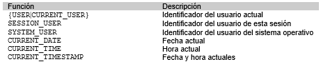
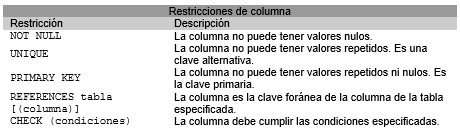
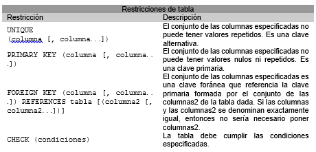

% SQL - Creación tablas
% Adolfo Sanz De Diego
% Noviembre 2016

# Acerca de

## Autor

- **Adolfo Sanz De Diego**
    - Blog: [asanzdiego.blogspot.com.es](http://asanzdiego.blogspot.com.es/)
    - Correo: [asanzdiego@gmail.com](mailto:asanzdiego@gmail.com)
    - GitHub: [github.com/asanzdiego](http://github.com/asanzdiego)
    - Twitter: [twitter.com/asanzdiego](http://twitter.com/asanzdiego)
    - LinkedIn: [in/asanzdiego](http://www.linkedin.com/in/asanzdiego)
    - SlideShare: [slideshare.net/asanzdiego](http://www.slideshare.net/asanzdiego/)

## Licencia

- **Copyright:**
    - Antonio Sarasa Cabezuelo <[antoniosarasa@campusciff.net](mailto:antoniosarasa@campusciff.net)>

## Fuente

- Las slides y sus fuentes las podéis encontrar en:
    - <https://github.com/asanzdiego/curso-intro-linux-web-sql-2016>

# Creación de tablas

## CREATE TABLE

- Para crear una tabla se utiliza la sentencia CREATE TABLE:

~~~
CREATE TABLE nombre_tabla
( definición_columna[, definición_columna...]
[, restricciones_tabla]);
~~~

- La definición de una columna consta del nombre
de la columna, un tipo de datos predefinido, un
conjunto de definiciones por defecto y
restricciones de columna.

## Tipos de datos

- Los principales tipos de datos predefinidos en
SQL que pueden asociarse a una columna
son:

## Valores por defecto

- Se pueden especificar valores por omisión
mediante la sentencia:

~~~
DEFAULT (literal|función|NULL)
~~~

    - Si se elige la **opción NULL**, entonces indica que la
columna debe admitir valores nulos.
    - Si se elige la **opción literal**, entonces indica que la
columna tomará el valor indicado por el literal.
    - Si se elige la **opción función**, se indicará alguna de las
funciones siguientes.

## Funciones

## Restricciones de columna

- Se pueden definir restricciones sobre las
columnas de la siguiente forma:

~~~
CONSTRAINT nombre_restricción [CHECK(condiciones)]
~~~

## Lista restricciones columna

## Restricciones tabla

- Se pueden especificar restricciones sobre toda la tabla:

## Ejemplo 1

~~~
Create table sucursal
(nombre_sucursal VARCHAR2(15) CONSTRAINT suc_PK PRIMARY KEY,
ciudad CHAR(20) NOT NULL CONSTRAINT cl_UK UNIQUE,
activos NUMBER(12,2) default 0);
~~~

## Ejemplo 2

~~~
Create table cliente
(dni VARCHAR2(9) NOT NULL,
nombre_cliente CHAR(35) NOT NULL,
domicilio CHAR(50) NOT NULL,
CONSTRAINT cl_PK PRIMARY KEY (dni));
~~~

## Ejemplo 3

~~~
Create table cuenta
(numero_cuenta CHAR (20) PRIMARY KEY,
nombre_sucursal char(15)
REFERENCES sucursal,
saldo NUMBER(12,2) default 100,
CONSTRAINT imp_minimo CHECK(saldo >=100))
~~~

## Ejemplo 4

~~~
Create table impositor
(dni CHAR(9) CONSTRAINT imp_dni_FK
REFERENCES cliente,
numero_cuenta CHAR(20) NOT NULL,
CONSTRAINT imp_PK PRIMARY KEY (dni, numero_cuenta),
CONSTRAINT imp_ct_FK FOREIGN KEY (numero_cuenta) REFERENCES cuenta)
~~~

## PK y FK

## Politicas de borrado (I)

- Cuando se define una clave foránea se puede
especificar las políticas de borrado y modificación
de filas que tienen una clave primaria
referenciada por claves foráneas de la siguiente forma:

~~~
FOREIGN KEY clave_secundaria REFERENCES tabla [(clave_primaria)]
[ON DELETE {NO ACTION | CASCADE | SET DEFAULT | SET NULL}]
[ON UPDATE {NO ACTION | CASCADE | SET DEFAULT | SET NULL}]
~~~

## Politicas de borrado (II)

- **NO ACTION** impide realizar alguna acción sobre un
valor de clave primaria si en la tabla referenciada hay
una valor de clave foránea relacionado.
- **CASCADE** representa la actualización en cascada.
Borra o actualiza el registro en la tabla referenciada y
en la tabla actual.
- **SET NULL** borra o actualiza el registro en la tabla
referenciada y establece en NULL la/s columna/s de
clave foránea en la tabla actual.
- **SET DEFAULT** indica que se ponga el valor especificado
por defecto.

## Ejemplo 3 actualizado

~~~
Create table cuenta
(numero_cuenta CHAR (20) PRIMARY KEY,
nombre_sucursal char(15)
CONSTRAINT ct_FK REFERENCES sucursal on delete set null,
saldo NUMBER(12,2) default 100,
CONSTRAINT imp_minimo CHECK(saldo >=100))
~~~

## Ejemplo 4 actualizado

~~~
Create table impositor
(dni CHAR(9) CONSTRAINT imp_dni_FK
REFERENCES cliente on delete cascade,
numero_cuenta CHAR(20),
CONSTRAINT imp_PK PRIMARY KEY (dni, numero_cuenta),
CONSTRAINT imp_ct_FK FOREIGN KEY (numero_cuenta)
REFERENCES cuenta on delete cascade)
~~~

## ALTER TABLE

- Para modificar una tabla se utiliza la sentencia:

~~~
ALTER TABLE nombre_tabla
{acción_modificar_columna|acción_modif_restricción_tabla};
~~~

## Modificar columna (I)

- Añadir atributos a una tabla.

~~~
alter table R add Atributo Dominio [propiedades]
~~~

- Eliminar atributos de una tabla.

~~~
alter table R drop COLUMN Atributo
~~~

## Modificar columna (II)

- Modificar atributos de una tabla.

~~~
alter table R modify (Atributo Dominio [propiedades])
~~~

- Renombrar atributos de una tabla.

~~~
alter table R rename column Atributo1 to Atributo2
~~~

## Modificar restricción (I)

- Añadir restricciones a una tabla.

~~~
alter table R add CONSTRAINT nombre Tipo (columnas)
~~~

- Eliminar restricciones de una tabla.

~~~
alter table R drop {PRIMARY KEY|UNIQUE(campos)|CONSTRAINT nombre [CASCADE]}
~~~

La opción CASCADE hace que se eliminen las restricciones de integridad
que dependen de la eliminada.

## Modificar restricción (II)

- Desactivar restricciones.

~~~
alter table R disable CONSTRAINT nombre [CASCADE]
~~~

- Activar restricciones.

~~~
alter table R enable CONSTRAINT nombre
~~~

## Ejemplo modificación

~~~
ALTER TABLE cuenta ADD comision NUMBER(4,2);
ALTER TABLE cuenta ADD fecha_apertura DATE;
ALTER TABLE cuenta DROP COLUMN nombre_sucursal;
ALTER TABLE cuenta MODIFY comision DEFAULT 1.5;
ALTER TABLE cliente MODIFY nombre_cliente NULL;
ALTER TABLE sucursal ADD CONSTRAINT cd_UK UNIQUE(ciudad);
~~~

## Borrado de tablas

- Para borrar una tabla se utiliza la sentencia:

~~~
DROP TABLE nombre_tabla{RESTRICT|CASCADE}
~~~

- **RESTRICT** indica que la tabla no se borrará si está
referenciada.

- **CASCADE** indica que todo lo que referencie a la tabla se
borrará con ésta.

## Descripción de tabla

~~~
describe R
~~~

## Renombrar tabla

~~~
rename R to S
~~~

## Borrar contenido

~~~
truncate table R
~~~

## Índices

- Los índices permiten que las bases de
datos **aceleren las operaciones de
consulta y ordenación** sobre los campos a
los que el índice hace referencia.

## Indices implícitos

- La mayoría de los índices se crean de
manera implícita, como consecuencia de
las restricciones PRIMARY KEY y UNIQUE.

## Indices explícitos

- Se pueden crear explícitamente para
aquellos campos sobre los cuales se
realizarán búsquedas e instrucciones de
ordenación frecuente.

~~~
CREATE [unique] INDEX NombreIndice
ON NombreTabla(col1,...,colk);
~~~

## Ejemplo índices

