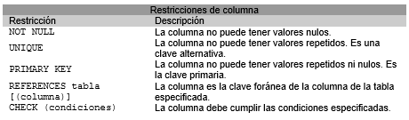

% SQL
% Adolfo Sanz De Diego
% Noviembre 2016

# Acerca de

## Autor

- **Adolfo Sanz De Diego**
    - Blog: [asanzdiego.blogspot.com.es](http://asanzdiego.blogspot.com.es/)
    - Correo: [asanzdiego@gmail.com](mailto:asanzdiego@gmail.com)
    - GitHub: [github.com/asanzdiego](http://github.com/asanzdiego)
    - Twitter: [twitter.com/asanzdiego](http://twitter.com/asanzdiego)
    - LinkedIn: [in/asanzdiego](http://www.linkedin.com/in/asanzdiego)
    - SlideShare: [slideshare.net/asanzdiego](http://www.slideshare.net/asanzdiego/)

## Licencia

- **Copyright:**
    - Antonio Sarasa Cabezuelo <[antoniosarasa@campusciff.net](mailto:antoniosarasa@campusciff.net)>

## Fuente

- Las slides y sus fuentes las podéis encontrar en:
    - <https://github.com/asanzdiego/curso-intro-linux-web-sql-2016>

# Creación de tablas

## CREATE TABLE

- Para crear una tabla se utiliza la sentencia CREATE TABLE:

~~~
CREATE TABLE nombre_tabla
( definición_columna[, definición_columna...]
[, restricciones_tabla]);
~~~

- La definición de una columna consta del nombre
de la columna, un tipo de datos predefinido, un
conjunto de definiciones por defecto y
restricciones de columna.

## Tipos de datos

- Los principales tipos de datos predefinidos en
SQL que pueden asociarse a una columna
son:

## Valores por defecto

- Se pueden especificar valores por omisión
mediante la sentencia:

~~~
DEFAULT (literal|función|NULL)
~~~

    - Si se elige la **opción NULL**, entonces indica que la
columna debe admitir valores nulos.
    - Si se elige la **opción literal**, entonces indica que la
columna tomará el valor indicado por el literal.
    - Si se elige la **opción función**, se indicará alguna de las
funciones siguientes.

## Funciones

## Restricciones de columna

- Se pueden definir restricciones sobre las
columnas de la siguiente forma:

~~~
CONSTRAINT nombre_restricción [CHECK(condiciones)]
~~~

## Lista restricciones columna

## Restricciones tabla

- Se pueden especificar restricciones sobre toda la tabla:

## Ejemplo 1

~~~
Create table sucursal
(nombre_sucursal VARCHAR2(15) CONSTRAINT suc_PK PRIMARY KEY,
ciudad CHAR(20) NOT NULL CONSTRAINT cl_UK UNIQUE,
activos NUMBER(12,2) default 0);
~~~

## Ejemplo 2

~~~
Create table cliente
(dni VARCHAR2(9) NOT NULL,
nombre_cliente CHAR(35) NOT NULL,
domicilio CHAR(50) NOT NULL,
CONSTRAINT cl_PK PRIMARY KEY (dni));
~~~

## Ejemplo 3

~~~
Create table cuenta
(numero_cuenta CHAR (20) PRIMARY KEY,
nombre_sucursal char(15)
REFERENCES sucursal,
saldo NUMBER(12,2) default 100,
CONSTRAINT imp_minimo CHECK(saldo >=100))
~~~

## Ejemplo 4

~~~
Create table impositor
(dni CHAR(9) CONSTRAINT imp_dni_FK
REFERENCES cliente,
numero_cuenta CHAR(20) NOT NULL,
CONSTRAINT imp_PK PRIMARY KEY (dni, numero_cuenta),
CONSTRAINT imp_ct_FK FOREIGN KEY (numero_cuenta) REFERENCES cuenta)
~~~

## PK y FK

## Politicas de borrado (I)

- Cuando se define una clave foránea se puede
especificar las políticas de borrado y modificación
de filas que tienen una clave primaria
referenciada por claves foráneas de la siguiente forma:

~~~
FOREIGN KEY clave_secundaria REFERENCES tabla [(clave_primaria)]
[ON DELETE {NO ACTION | CASCADE | SET DEFAULT | SET NULL}]
[ON UPDATE {NO ACTION | CASCADE | SET DEFAULT | SET NULL}]
~~~

## Politicas de borrado (II)

- **NO ACTION** impide realizar alguna acción sobre un
valor de clave primaria si en la tabla referenciada hay
una valor de clave foránea relacionado.
- **CASCADE** representa la actualización en cascada.
Borra o actualiza el registro en la tabla referenciada y
en la tabla actual.
- **SET NULL** borra o actualiza el registro en la tabla
referenciada y establece en NULL la/s columna/s de
clave foránea en la tabla actual.
- **SET DEFAULT** indica que se ponga el valor especificado
por defecto.

## Ejemplo 3 actualizado

~~~
Create table cuenta
(numero_cuenta CHAR (20) PRIMARY KEY,
nombre_sucursal char(15)
CONSTRAINT ct_FK REFERENCES sucursal on delete set null,
saldo NUMBER(12,2) default 100,
CONSTRAINT imp_minimo CHECK(saldo >=100))
~~~

## Ejemplo 4 actualizado

~~~
Create table impositor
(dni CHAR(9) CONSTRAINT imp_dni_FK
REFERENCES cliente on delete cascade,
numero_cuenta CHAR(20),
CONSTRAINT imp_PK PRIMARY KEY (dni, numero_cuenta),
CONSTRAINT imp_ct_FK FOREIGN KEY (numero_cuenta)
REFERENCES cuenta on delete cascade)
~~~

## ALTER TABLE

- Para modificar una tabla se utiliza la sentencia:

~~~
ALTER TABLE nombre_tabla
{acción_modificar_columna|acción_modif_restricción_tabla};
~~~

## Modificar columna (I)

- Añadir atributos a una tabla.

~~~
alter table R add Atributo Dominio [propiedades]
~~~

- Eliminar atributos de una tabla.

~~~
alter table R drop COLUMN Atributo
~~~

## Modificar columna (II)

- Modificar atributos de una tabla.

~~~
alter table R modify (Atributo Dominio [propiedades])
~~~

- Renombrar atributos de una tabla.

~~~
alter table R rename column Atributo1 to Atributo2
~~~

## Modificar restricción (I)

- Añadir restricciones a una tabla.

~~~
alter table R add CONSTRAINT nombre Tipo (columnas)
~~~

- Eliminar restricciones de una tabla.

~~~
alter table R drop {PRIMARY KEY|UNIQUE(campos)|CONSTRAINT nombre [CASCADE]}
~~~

La opción CASCADE hace que se eliminen las restricciones de integridad
que dependen de la eliminada.

## Modificar restricción (II)

- Desactivar restricciones.

~~~
alter table R disable CONSTRAINT nombre [CASCADE]
~~~

- Activar restricciones.

~~~
alter table R enable CONSTRAINT nombre
~~~

## Ejemplo modificación

~~~
ALTER TABLE cuenta ADD comision NUMBER(4,2);
ALTER TABLE cuenta ADD fecha_apertura DATE;
ALTER TABLE cuenta DROP COLUMN nombre_sucursal;
ALTER TABLE cuenta MODIFY comision DEFAULT 1.5;
ALTER TABLE cliente MODIFY nombre_cliente NULL;
ALTER TABLE sucursal ADD CONSTRAINT cd_UK UNIQUE(ciudad);
~~~

## Borrado de tablas

- Para borrar una tabla se utiliza la sentencia:

~~~
DROP TABLE nombre_tabla{RESTRICT|CASCADE}
~~~

- **RESTRICT** indica que la tabla no se borrará si está
referenciada.

- **CASCADE** indica que todo lo que referencie a la tabla se
borrará con ésta.

## Descripción de tabla

~~~
describe R
~~~

## Renombrar tabla

~~~
rename R to S
~~~

## Borrar contenido

~~~
truncate table R
~~~

## Índices

- Los índices permiten que las bases de
datos **aceleren las operaciones de
consulta y ordenación** sobre los campos a
los que el índice hace referencia.

## Indices implícitos

- La mayoría de los índices se crean de
manera implícita, como consecuencia de
las restricciones PRIMARY KEY y UNIQUE.

## Indices explícitos

- Se pueden crear explícitamente para
aquellos campos sobre los cuales se
realizarán búsquedas e instrucciones de
ordenación frecuente.

~~~
CREATE [unique] INDEX NombreIndice
ON NombreTabla(col1,...,colk);
~~~

## Ejemplo índices

# Consulas básicas

## SELECT FROM
- Para hacer consultas sobre una tabla se utiliza la
sentencia SELECT:
SELECT nombre_columna_a_seleccionar [[AS]
col_renombrada]
[,nombre_columna_a_seleccionar [[AS]
col_renombrada]...]
FROM tabla_a_consultar [[AS] tabla_renombrada];
- La palabra clave AS permite renombrar las columnas
que se quieren seleccionar o las tablas que se quieren
consultar. Esta palabra es opcional.

## SELECT FROM
- Por ejemplo si queremos seleccionar las columnas
código, nombre, dirección y ciudad de la tabla clientes
usaríamos la sentencia:
SELECT codigo_cli, nombre_cli, direccion, ciudad FROM
clientes;
- Sin embargo si se quieren recuperar todas las
columnas de la tabla se usa el símbolo “\*”, en vez de
listar todas las columnas:
SELECT * FROM clientes;

## SELECT FROM WHERE
- Si se quieren seleccionar que filas son recuperadas se
utiliza la siguiente estructura:
SELECT [DISTINCT|ALL] nombre_columnas_a_seleccionar
FROM tabla_a_consultar [WHERE condiciones];

- La clausula WHERE permite recuperar sólo aquellas filas
que cumplen la condición especificada.
- La clausula DISTINCT permite indicar que nos muestre las
filas resultantes sin repeticiones. La opción por defecto es
ALL que indica que muestre todas las filas.

## SELECT FROM WHERE
- Para construir las condiciones de la clausula
WHERE es necesario usar operadores de
comparación o lógicos: <(menor), >(mayor),
=(igual), <=(menor o igual), >=(mayor o
igual),<>(distinto),
AND(conjunción
de
condiciones), OR(disyunción de condiciones),
NOT(negación).

## SELECT FROM WHERE
- Por ejemplo si se quieren recuperar los diferentes
sueldos de la tabla empleados:
SELECT DISTINCT sueldo FROM empleados;

- Y si se quieren recuperar los empleados de la
tabla empleados cuyo sueldo es mayor de 1000
euros:
SELECT * FROM empleados WHERE sueldo> 1000;

## Subconsultas
- Una subconsulta es una consulta incluida
dentro de otra consulta, y que aparece como
parte de una cláusula WHERE.

## Subconsultas
- Por ejemplo se quiere obtener los proyectos
de la tabla proyectos que se corresponden con
un cliente que tiene como NIF el número
“444555-E”:
SELECT * FROM proyectos
WHERE codigo_cliente = (SELECT código_cli
FROM clientes WHERE nif=“444555-E”)

## Predicados
- En la condición que aparece en la clausula
WHERE se pueden utilizar un conjunto de
predicados predefinidos para construir las
condiciones:
    - BETWEEN. Expresa que se quiere encontrar un valor
entre unos límites concretos:

SELECT nombre_columnas_a_seleccionar
FROM tabla_a_consultar
WHERE columna BETWEEN límite1 AND
límite2;

## Predicados
- Por ejemplo se quieren recuperar todos los
empleados cuyos sueldos están entre 1000
y 2000 euros:
SELECT codigo_empl FROM empleados
WHERE sueldo BETWEEN 1000 and 2000;

## Predicados
    - IN. Comprueba si un valor coincide con los
elementos de una lista (IN) o no coincide(NOT IN):

SELECT nombre_columnas_a_seleccionar
FROM tabla_a_consultar
WHERE columna [NOT] IN (valor1, ...,
valorN);

## Predicados
- Por ejemplo se quieren recuperar todos los
clientes que viven en Madrid y Zaragoza:
SELECT * FROM clientes
WHERE ciudad IN (‘Madrid’, ‘Zaragoza’);

## Predicados
    - LIKE. Comprueba si una columna de tipo carácter
cumple una condición determinada.

SELECT nombre_columnas_a_seleccionar
FROM tabla_a_consultar
WHERE columna LIKE condición;
Existen un conjunto de caracteres que actúan
como comodines:
- El carácter _ para cada representar un carácter individual.
- El carácter % para expresar una secuencia de caracteres
incluido la secuencia vacía.

## Predicados
    - Por ejemplo si se quieren recuperar los clientes cuya
ciudad de residencia termina por la letra “d”:
SELECT * FROM clientes WHERE ciudad LIKE ‘%d’;
    - Y si se quiere refinar la consulta anterior y recuperar los
clientes cuya ciudad de residencia termina por la letra
“d” y el nombre de la ciudad tiene 5 letras:
SELECT * FROM clientes WHERE ciudad LIKE ‘_ _ _ _ d’;

## Predicados
    - IS NULL. Comprueba si un valor nulo(IS NULL) o no
lo es(IS NOT NULL):

SELECT nombre_columnas_a_seleccionar
FROM tabla_a_consultar
WHERE columna IS [NOT] NULL;

## Predicados
- Por ejemplo se quieren recuperar todos los
clientes que no tienen un número de
teléfono:
SELECT * FROM clientes WHERE teléfono IS NULL;

## Predicados
    - EXISTS. Comprueba si una consulta produce algún
resultado(EXISTS) o no(NOT EXISTS):

SELECT nombre_columnas_a_seleccionar
FROM tabla_a_consultar
WHERE [NOT] EXISTS subconsulta;

## Predicados
•

Por ejemplo se quieren recuperar todos los empleados que
están asignados a algún proyecto:
SELECT * FROM empleados
WHERE EXISTS (SELECT * FROM proyectos
WHERE codigo_proyec = num_proyec);

## Predicados
    - ANY/SOME/ALL. Comprueba si todas(ALL) o
algunas(SOME/ANY) de las filas de una columna
cumplen las condiciones especificadas:

SELECT nombre_columnas_a seleccionar
FROM tabla_a_consultar
WHERE columna operador_comparación
{ALL|ANY|SOME}subconsulta;

## Predicados
    - Por ejemplo si se quiere recuperar todos los proyectos en los que los
sueldos de todos los empleados asignados son menores que el precio
del proyecto:

SELECT * FROM proyectos
WHERE precio > ALL (SELECT sueldo
FROM empleados WHERE codigo_proyec = num_proyec);
    - Si la condición se relaja, y sólo se pide que la condición sólo ocurra
para algunos empleados, entonces sería:

SELECT * FROM proyectos
WHERE precio > SOME (SELECT sueldo
FROM empleados WHERE codigo_proyec = num_proyec);

## Order by
- Para ordenar los resultados de una consulta se utiliza la cláusula
ORDER BY:
SELECT nombre_columnas_a seleccionar
FROM tabla_a_consultar
[WHERE condiciones]
ORDER BY columna_según_la_cual_se_quiere_ordenar [DESC]
[, col_ordenación [DESC]...];
- Por defecto los resultados se ordenan de manera ascendente. Así si
queremos realizar una ordenación descendente se debe indicar
usando la cláusula DESC.

## Order by
- Por ejemplo si queremos ordenar los
empleados por orden alfabético ascendente
de a cuerdo a su nombre y descendente de
acuerdo a su sueldo:
SELECT * FROM empleados
ORDER BY nombre_empl, sueldo DESC;

# Consultas varias tablas

## Consulta de más de una tabla.
- En la cláusula FROM es posible especificar más de una
tabla cuándo se quieren consultar columnas de tablas
diferentes.
- Existen varios casos:
    - Combinación. Se crea una sola tabla a partir de las tablas
especificadas, haciendo coincidir los valores de las
columnas relacionadas de las tablas.

SELECT nombre_columnas_a_seleccionar
FROM tabla1 JOIN tabla2
{ON condiciones|USING (columna [, columna...])}
[WHERE condiciones];

## Consulta de más de una tabla.
- La opción ON permite expresar condiciones con
cualquiera de los operadores de comparación
sobre las columnas especificadas.
- Es posible utilizar una misma tabla dos veces
usando alias diferentes para diferenciarlas.
- Puede ocurrir que las tablas consideradas tengan
columnas con los mismos nombres. En este caso
es obligatorio diferenciarlas especificando en
cada columna a que tabla pertenecen.

## Consulta de más de una tabla.
- Por ejemplo se quiere obtener el nif del cliente y el precio de los
proyectos desarrollados para el cliente con código 30.
SELECT p.precio, c.nif FROM clientes c JOIN proyectos p
ON c.codigo_cli = p.codigo_cliente WHERE c.codigo_cli = 30;
- Alternativamente se podría obtener con la siguiente consulta:
SELECT p.precio, c.nif FROM clientes c, proyectos p
WHERE c.codigo_cli = p.codigo_cliente AND c.codigo_cli = 20;

## Consulta de más de una tabla.
- Por ejemplo si se quieren los códigos de los
proyectos que son más caros que el proyecto
con código 30
SELECT p1.codigo_proyec
FROM proyectos p1 JOIN proyectos p2 ON
p1.precio > p2.precio
WHERE p2.codigo_proyec = 30;

## Consulta de más de una tabla.
- Combinación natural. Consiste en una
combinación en la que se eliminan las
columnas repetidas.
SELECT nombre_columnas_a_seleccionar
FROM tabla1 NATURAL JOIN tabla2 [WHERE
condiciones];

## Consulta de más de una tabla.
- Por ejemplo si se quiere obtener los empleados
cuyo departamento se encuentra situado en
Madrid:
SELECT * FROM empleados NATURAL JOIN
departamentos WHERE ciudad = ‘Madrid';
- De forma equivalente se podría consultar:
SELECT * FROM empleados JOIN departamentos
USING (nombre_dep, ciudad_dep) WHERE
ciudad = ‘Madrid';

## Consulta de más de una tabla.
- Combinación

interna(inner

join).

Sólo se
consideran las filas que tienen valores idénticos en las
columnas de las tablas que compara.

SELECT nombre_columnas_a_seleccionar
FROM t1 INNER JOIN t2
{ON condiciones||USING (columna
[,columna...])}
[WHERE condiciones];

## Consulta de más de una tabla.
- Combinación externa(outer join). Se
consideran los valores de la tabla derecha,
de la izquierda o de ambas tablas.
SELECT nombre_columnas_a_seleccionar
FROM t1 [LEFT|RIGHT|FULL] [OUTER] JOIN
t2
{ON condiciones| [USING (columna
[,columna...])}
[WHERE condiciones];

## Consulta de más de una tabla.
- Combinación de más de 2 tablas. Para
combinar más de 2 tablas basta añadirlas en
el FROM de la consulta y establecer las
relaciones necesarias en el WHERE, o bien
combinar las tablas por pares de manera que
la resultante es el primer componente del
siguiente par.

## Consulta de más de una tabla.
- Por ejemplo si se quieren combinar las tablas
empleados, proyectos y clientes:
SELECT * FROM empleados, proyectos, clientes
WHERE num_proyec = codigo_proyec AND
codigo_cliente = codigo_cli;
O bien:
SELECT * FROM (empleados JOIN proyectos ON
num_proyec = codigo_proyec)JOIN clientes ON
codigo_cliente = codigo_cli;

## Operaciones entre consultas
- Entre 2 tablas se pueden definir las siguientes
operaciones:
    - Unión. Permite unir los resultados de 2 o más
consultas.

SELECT columnas FROM tabla [WHERE
condiciones]
UNION [ALL]
SELECT columnas FROM tabla[WHERE
condiciones];
    - Observar que la cláusula ALL indica si se quieren obtener todas las filas de
la unión(incluidas las repetidas)

## Operaciones entre consultas
- Por ejemplo si se quiere obtener todas las
ciudades que aparecen en las tablas de la base
de datos:
SELECT ciudad FROM clientes
UNION
SELECT ciudad_dep FROM departamentos;

## Operaciones entre consultas
    - Intersección. Permite hacer la intersección entre los
resultados de 2 o más consultas.

SELECT columnas FROM tabla [WHERE
condiciones]
INTERSECT [ALL]
SELECT columnas FROM tabla [WHERE
condiciones];
•Observar:
    - La cláusula ALL indica si se quieren obtener todas
las filas de la intersección(incluidas las repetidas)

## Operaciones entre consultas
- Se puede simular usando:
    - IN

SELECT columnas FROM tabla WHERE
columna
IN (SELECT columna FROM tabla [WHERE
condiciones]);
    - EXISTS

SELECT columnas FROM tabla WHERE
EXISTS (SELECT * FROM tabla WHERE
condiciones);

## Operaciones entre consultas
- Por ejemplo si se quiere saber las ciudades de los
clientes en las que hay departamentos:
    - Usando la intersección.

SELECT ciudad FROM clientes INTERSECT
SELECT ciudad_dep FROM departamentos;
    - Usando IN

SELECT c.ciudad FROM clientes c WHERE c.ciudad
IN (SELECT d.ciudad_dep FROM departamentos d);
    - Usando EXISTS

SELECT c.ciudad FROM clientes c WHERE EXISTS
(SELECT * FROM departamentos d WHERE c.ciudad
= d.ciudad_dep;

## Operaciones entre consultas
    - Diferencia. Permite hacer la diferencia entre los
resultados de 2 o más consultas.

SELECT columnas FROM tabla [WHERE
condiciones]
EXCEPT
SELECT columnas FROM tabla [WHERE
condiciones];

## Operaciones entre consultas
- Se puede simular usando:
    - NOT IN

SELECT columnas FROM tabla WHERE
columna NOT IN (SELECT columna FROM
tabla [WHERE condiciones]);
    - NOT EXISTS

SELECT columnas FROM tabla WHERE
NOT EXISTS (SELECT * FROM tabla WHERE
condiciones);

## Operaciones entre consultas
- Por ejemplo si se quiere saber las ciudades de los clientes
en las que no hay departamentos:
    - Usando la diferencia.

SELECT ciudad FROM clientes EXCEPT
SELECT ciudad_dep FROM departamentos;
    - Usando NOT IN

SELECT c.ciudad FROM clientes c WHERE c.ciudad NOT
IN (SELECT d.ciudad_dep FROM departamentos d);
    - Usando NOT EXISTS

SELECT c.ciudad FROM clientes c WHERE NOT EXISTS
(SELECT * FROM departamentos d WHERE c.ciudad =
d.ciudad_dep;

% SQL - Operaciones tablas
% Adolfo Sanz De Diego
% Noviembre 2016

# Acerca de

## Autor

- **Adolfo Sanz De Diego**
    - Blog: [asanzdiego.blogspot.com.es](http://asanzdiego.blogspot.com.es/)
    - Correo: [asanzdiego@gmail.com](mailto:asanzdiego@gmail.com)
    - GitHub: [github.com/asanzdiego](http://github.com/asanzdiego)
    - Twitter: [twitter.com/asanzdiego](http://twitter.com/asanzdiego)
    - LinkedIn: [in/asanzdiego](http://www.linkedin.com/in/asanzdiego)
    - SlideShare: [slideshare.net/asanzdiego](http://www.slideshare.net/asanzdiego/)

## Licencia

- **Copyright:**
    - Antonio Sarasa Cabezuelo <[antoniosarasa@campusciff.net](mailto:antoniosarasa@campusciff.net)>

## Fuente

- Las slides y sus fuentes las podéis encontrar en:
    - <https://github.com/asanzdiego/curso-intro-linux-web-sql-2016>

## Funciones de Agregación
- Las funciones de agregación son funciones
que permiten realizar operaciones sobre los
datos de una columna. Algunas funciones son
las siguientes:

## Funciones de Agregación
- En general, las funciones de agregación se
aplican a una columna, excepto COUNT que se
aplica a todas las columnas de las tablas
seleccionadas. Se indica como COUNT (\*).

## Funciones de Agregación
- Sin embargo si se especifica COUNT(distinct
columna), entonces sólo contará los valores
que no nulos ni repetidos, y se especifica
COUNT (columna), sólo contaría los valores
que no son nulos.

## Funciones de agregación
- Por ejemplo si se quieren contar el número de
clientes de la tabla clientes cuya ciudad es
“Madrid”:
SELECT COUNT(\*) AS numero_clie FROM
clientes WHERE ciudad = ‘Madrid’;

## Agrupación de filas
- Al realizar una consulta, las filas se pueden agrupar de la siguiente
manera:
SELECT nombre_columnas_a seleccionar
FROM tabla_a_consultar [WHERE condiciones]
GROUP BY columnas_según_las_cuales_se_quiere_agrupar
[HAVING condiciones_por_grupos]
[ORDER BY columna_ordenación [DESC] [, columna [DESC]...]];

La cláusula GROUP BY permite agrupar las filas según las columnas
indicadas, excepto aquellas afectadas por funciones de agregación.
La cláusula HAVING especifica las condiciones para recuperar grupos de
filas.

## Agrupación de filas
- Por ejemplo si se quiere conocer el importe total de los proyectos
agrupados por clientes:
SELECT código_cliente, SUM(precio) AS importe FROM clientes
GROUP BY codigo_cliente;
- Y si solo queremos aquellos clientes con un importe facturado
mayor de 10000 euros
SELECT código_cliente FROM clientes
GROUP BY codigo_cliente
HAVING SUM(precio)>10000

## Vistas
- Una vista es una tabla ficticia que se construye a partir de
una consulta a una tabla real
CREATE VIEW nombre_vista [(lista_columnas)] AS
(consulta) [WITH CHECK OPTION];
- donde se indica el nombre de la vista, a continuación se
pueden especificar los nombres de las columnas de la vista,
se define la consulta que construirá la vista, y se puede
añadir la clausula “with check option” para evitar
inserciones o actualizaciones excepto en los registros en
que la cláusula WHERE de la consulta se evalúe como true.

## Vistas
- Para borrar una vista se utiliza la sentencia:
DROP VIEW nombre_vista (RESTRICT|CASCADE);

    - La opción RESTRICT indica que la vista no se
borrará si está referenciada,
    - La opción CASCADE indica que todo lo que
referencie a la vista se borrará con ésta.

## Vistas
- Para ilustrar las vistas, se van a
considerar las siguientes tablas:
    - Tabla clientes:

    - Tabla pedidos:

## Vistas
- Si se quiere crear una vista que indique
para cada cliente el número de pedidos
que tiene encargados el cliente, se
definiría la vista:
CREATE VIEW pedidos_por_cliente (codigo_cli, num_pedidos) AS
(SELECT c.codigo_cli, COUNT(\*) FROM pedidos p, clientes c WHERE
p.codigo_cliente = c.codigo_cli GROUP BY c.codigo_cli);

Y se obtendría la vista:

# Operaciones actualización

## Inserción de filas en una tabla
- Para poder consultar los datos de una base de
datos hay que introducirlos con la sentencia
INSERT INTO VALUES:
INSERT INTO nombre_tabla [(columnas)]
{VALUES ({v1|DEFAULT|NULL}, ...,
{vn/DEFAULT/NULL})|<consulta>};

## Inserción de filas en una tabla
- Los valores v1, v2, ..., vn se deben corresponder
con las columnas de la tabla especificada y deben
estar en el mismo orden.
- También es posible especificar el nombre de las
columnas de la tabla. En este último caso, los
valores se deben disponer de forma coherente
con el nuevo orden.
- Si se quiere especificar que un valor por omisión
se usa la palabra reservada DEFAULT, y si se trata
de un valor nulo se usa la palabra reservada
NULL.

## Inserción de filas en una tabla
- Observar que para insertar más de una fila
con una sola sentencia, se deben obtener los
datos mediante una consulta a otras tablas.

## Inserción de filas en una tabla
- Por ejemplo si se quiere insertar en una tabla clientes
que tiene las columnas :nif, nombre_cli, codigo_cli,
telefono, direccion, ciudad, se podría hacer de dos
formas:
INSERT INTO clientes
VALUES (10, ‘Mercadona’, ‘122233444-C’, ‘Gran vida 8’,
‘Madrid’, DEFAULT);
INSERT INTO clientes(nif, nombre_cli, codigo_cli,
telefono, direccion, ciudad)
VALUES (‘122233444-C’, ‘Mercadona’, 10, DEFAULT,
‘Gran vida 8’, ‘Madrid’);

## Inserción de filas en una tabla
- Insertar un préstamo en la relación Préstamo
INSERT INTO Prestamo
VALUES (‘Navacerrada’, ‘Pepe Pérez’, 125.000)

- También es posible obtener
mediante una consulta SELECT
INSERT INTO Prestamo
SELECT * FROM Nuevos_Prestamos

los

datos

## Borrado de filas de una tabla
- Para borrar valores de algunas filas de una
tabla se usa la sentencia DELETE:
DELETE FROM nombre_tabla [WHERE
condiciones];

## Borrado de filas de una tabla
- Observar que si no se utiliza la clausula
WHERE se borran todas las filas de la tabla, en
cambio si se utiliza WHERE entonces solo se
borran aquellas filas que cumplen las
condiciones especificadas.

## Borrado de filas de una tabla.
- Por ejemplo si se quieren borrar todas las filas
de la tabla proyectos se usaría la sentencia:
DELETE FROM proyectos;

- Si solo se quieren borrar las filas de la tabla en
las que el valor de la columna cliente vale 12,
entonces se usaría la sentencia:
DELETE FROM proyectos WHERE codigo_cliente = 12;

## Borrado de filas de una tabla.
- La clausula WHERE admite consultas anidadas
como por ejemplo la consulta que quiere
borrar todos los clientes que tengan un
préstamo no registrado en la relación
Préstamo.
DELETE
FROM Clientes
WHERE Clientes.NumPrestamo NOT IN
(SELECT NumPrestamo FROM Prestamo)

## Modificación de filas de una tabla
- Para modificar los valores de algunas filas de
una tabla se usa la sentencia UPDATE:
UPDATE nombre_tabla
SET columna = {expresión|DEFAULT|NULL}
[, columna = {expresión|DEFAULT|NULL} ...]
WHERE condiciones;

## Modificación de filas de una tabla
- La cláusula SET indica qué columna modificar
y los valores que puede recibir, y la cláusula
WHERE
especifica
qué
filas
deben
actualizarse.
- La parte WHERE es opcional y, si no se
especifica, se actualizarán todas las tuplas de
la tabla.

## Modificación de filas de una tabla.
- Por ejemplo si se quiere inicializar el sueldo de
todos los empleados del proyecto 2 en 500
euros:
UPDATE empleados SET sueldo = 500
WHERE num_proyec = 2;

## Modificación de Datos
- La clausula WHERE admite consultas anidadas como
por ejemplo la siguiente consulta que quiere modificar
todos los prestamos cuya sucursal hay sido cerrada a la
sucursal ‘Centro’.
UPDATE Prestamo
SET sucursal= ‘Centro’
WHERE sucursal IN
(SELECT sucursal
FROM Sucursales_Cerradas)
